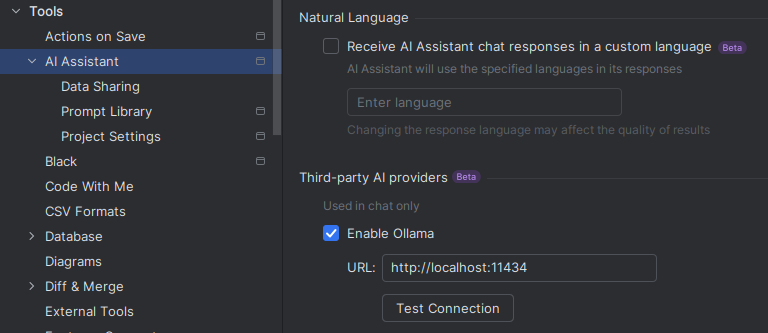
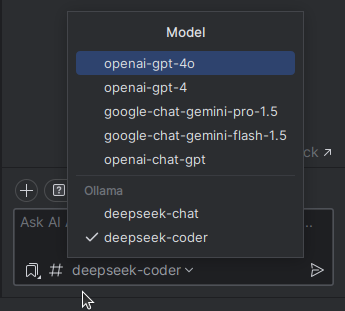

# How to Integrate DeepSeek into AI Assistant as a Third-Party Provider

This guide will walk you through the steps to integrate DeepSeek into AI Assistant as a third-party provider.

## Prerequisites
- Ensure you have the necessary API key from DeepSeek.

## Steps to Integrate

1. **Create a Run Configuration for `fake_ollama_server.py`**
    - Open your project in PyCharm.
    - Navigate to `Run > Edit Configurations`.
    - Add a new configuration for `fake_ollama_server.py`.

2. **Add Your API Key to the Environment**
    - In the run configuration, go to the `Environment variables` section.
    - Add your DeepSeek API key as an environment variable.

3. **Configure Third-Party AI Providers**
    - Go to `Tools > AI Assistant > Third-party AI providers`.
    - AI Assistant will automatically detect the server (approximately every minute).

4. **Select the Model**
    - Once the server is detected, you can choose the DeepSeek model from the available options.

## Screenshots

- **Third-Party AI Providers Configuration**  
  

- **AI Assistant Chat Interface**  
  

## Notes
- Ensure the `fake_ollama_server.py` is running before proceeding with the integration.
- If the server is not detected, restart the server and check the environment variables.
