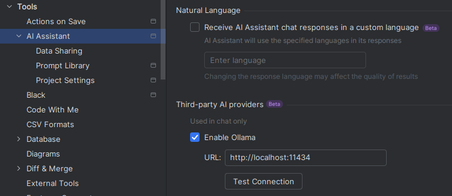
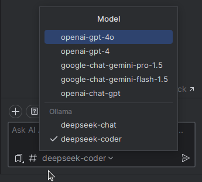

# DeepSeek Integration Guide for AI Assistant in PyCharm

This guide provides step-by-step instructions to integrate **DeepSeek V3** into **AI Assistant** as a third-party provider in **PyCharm 2024.3.1 (Professional Edition)**. Data is routed through a fake OLLAMA server to DeepSeek.

---

## Prerequisites
- **DeepSeek API Key**: Ensure you have the necessary API key from DeepSeek.
- **Python/Docker Knowledge**: Basic understanding of Python and Docker is required.

---

## Setting Up the Fake OLLAMA Server

### Using Docker
Run the following command from project to build, remove previous container and start the docker container fake OLLAMA server:
```bash
docker build -t fake-ollama-server . && docker run --rm -e API_KEY=your_api_key_here -p 11434:11434 fake-ollama-server
```

### Using Python
1. **Set Up the Repository**:
    - Clone the repository.
    - Create a virtual environment.
    - Install dependencies from `requirements.txt`.

2. **Configure PyCharm**:
    - Open your project in PyCharm.
    - Navigate to `Run > Edit Configurations`.
    - Add a new configuration for `fake_ollama_server.py`.
    - Add your DeepSeek API key as an environment variable in the run configuration.

---

## Configuring AI Assistant in PyCharm

1. **Add Third-Party AI Provider**:
    - Go to `Tools > AI Assistant > Third-party AI providers`.
    - AI Assistant will automatically detect the server (approximately every minute).

2. **Select the Model**:
    - Once the server is detected, choose the DeepSeek model from the available options.

3. **Use the Model**:
    - Enter a user prompt to interact with the selected model.

---

## Visual Guides
**Python Setup**


**Third-Party AI Providers Configuration**



**AI Assistant Chat Interface**



---

## Notes
- Ensure `fake_ollama_server.py` is running before proceeding with the integration.
- If the server is not detected, restart the server and verify the environment variables.

---

## Useful Links
- [PyCharm AI Assistant Documentation](https://www.jetbrains.com/help/pycharm/ai-assistant.html)
- [DeepSeek Chat](https://chat.deepseek.com/)
- [DeepSeek API Documentation](https://api-docs.deepseek.com/)
- [OLLAMA GitHub Repository](https://github.com/ollama/ollama)

---

## Join the Community
We welcome contributions and feedback! If you have suggestions or encounter issues, please:
- Open an [issue](https://github.com/RobToMars/DeepSeek/issues).
- Submit a [pull request](https://github.com/RobToMars/DeepSeek/pulls).

Let’s improve this integration together!

---

### Credits
- **DeepSeek V3**: With system prompts of AI Assistant in PyCharm 2024.3.1 (Professional Edition) and the web chat edition.
- [RobToMars](https://github.com/RobToMars)
- [starkirby125918](https://github.com/starkirby125918)

---

For further assistance, refer to the official DeepSeek documentation or contact the support team.